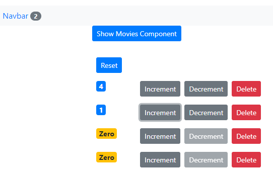
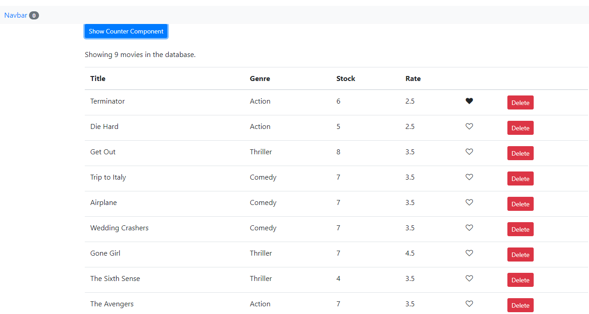

# React Simple Components

## About examples:

Props, Raising and Handling Events, Lifting the State, Functional Components, Lifecycle Hooks 

In this project are components, which go through a few phases during their lifecycle.  
`The first phase is the mounting phase`, and this is when an instance of a component is created and inserted into the DOM. There are a few special methods that we can add to our components and React will automaticlly call these methods. We refer to these methods as livecycle hooks. So they allow us to hook into certain moments during the lifecycle of a component and do something. In the mounting phase we have 3 lifecycle hooks: `countructor`, `render` and `componentDidMount`. React will call these methods in order. The method `componentDidMount` is called after our component is rendered into the DOM, and it's the pervect place to make AJAX calls, to get data from the server. When a component is mounted, that means the component is in the DOM. One thing what you need know about the render method is when a component is rendered all it's children are also rendered recursively.
 
`The second lifestyle is the update phase`, and this happens when the state, or the props of a component get changed. In this phase we have 2 lifecycle hooks, `render` and `componentDidUpdate`. So whenever we change the state of a component, or give it new props, these two methods are called in order. Update phase happens whenever the state or props of a component changes. This method is called after a component is updated. Which means we have new state or new props, so we can compare this new state with the old state or the new props with the old props and if there's a change we can make an AJAX request to get new data from the server. 
`And the last phase is the unmounting phase`, and this is when a component is removed from the DOM such as when we delete the counter. I mean `componentWillUnmount`. ComponentWillUnmount method is called just before a component is removed from the DOM. React compare virtual DOM with the old one, it figures out that one of our component is removed, so then it will call component will unmount before removing this component from the DOM. And this gives us an opportunity to do any kind of cleanup. So if you have set up timers, or listeners, we can clean those up before this component is removed from the DOM, otherwise we'll end up with memory leaks 

### Content:

components/:

- [./src/components/common/like.jsx](./src/components/common/like.jsx)

components/:

- [./src/components/counter.jsx](./src/components/counter.jsx)
- [./src/components/counters.jsx](./src/components/counters.jsx)
- [./src/components/movies.jsx](./src/components/movies.jsx)
- [./src/components/navbar.jsx](./src/components/navbar.jsx)

services/:

- [./src/services/fakeMovieService.js](./src/services/fakeMovieService.js)

src/App.jsx

- [./src/App.jsx](./src/App.jsx)

#Project screenshot:

Counter component 

Movies component 

This project was bootstrapped with [Create React App](https://github.com/facebook/create-react-app).

## Available Scripts

In the project directory, you can run:

### `npm start`

Runs the app in the development mode. 
Open [http://localhost:3000](http://localhost:3000) to view it in the browser.

The page will reload if you make edits. 
You will also see any lint errors in the console.

### `npm test`

Launches the test runner in the interactive watch mode. 
See the section about [running tests](https://facebook.github.io/create-react-app/docs/running-tests) for more information.

### `npm run build`

Builds the app for production to the `build` folder. 
It correctly bundles React in production mode and optimizes the build for the best performance.

The build is minified and the filenames include the hashes. 
Your app is ready to be deployed!

See the section about [deployment](https://facebook.github.io/create-react-app/docs/deployment) for more information.

### `npm run eject`

**Note: this is a one-way operation. Once you `eject`, you can’t go back!**

If you aren’t satisfied with the build tool and configuration choices, you can `eject` at any time. This command will remove the single build dependency from your project.

Instead, it will copy all the configuration files and the transitive dependencies (Webpack, Babel, ESLint, etc) right into your project so you have full control over them. All of the commands except `eject` will still work, but they will point to the copied scripts so you can tweak them. At this point you’re on your own.

You don’t have to ever use `eject`. The curated feature set is suitable for small and middle deployments, and you shouldn’t feel obligated to use this feature. However we understand that this tool wouldn’t be useful if you couldn’t customize it when you are ready for it.

## Learn More

You can learn more in the [Create React App documentation](https://facebook.github.io/create-react-app/docs/getting-started).

To learn React, check out the [React documentation](https://reactjs.org/).
